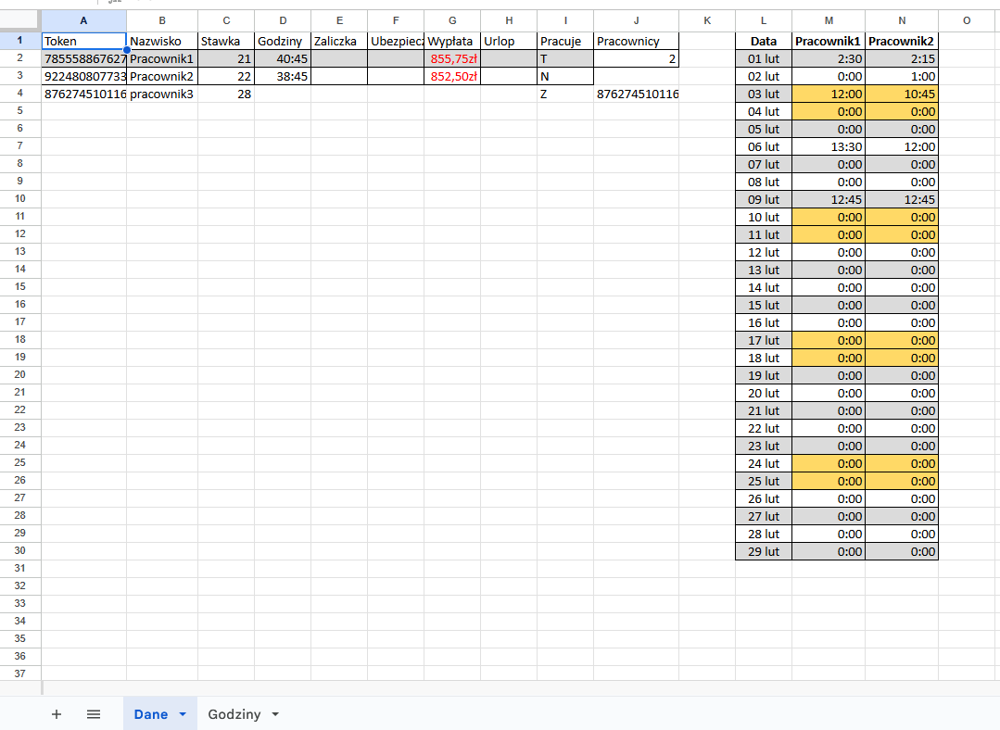

<h2>Overview:  </h2>
&emsp;Working time registration system based on a Raspberry Pi Zero microcomputer and an RS522 RFID reader (13.56 MHz). The graphical interface is auto-generated .xlsx files.

<h2>Gui:</h2>

<h4> • Sheet "DANE" - Employees basic and payment information  </h4>
    <h4>Columns desc: </h4>
    &emsp;A - Rfid token id.  
    &emsp;B - Employee name.  
    &emsp;C - Salary per hour.  
    &emsp;D - Summary working time completed by the employee.  
    &emsp;E - Advanced payment.  
    &emsp;F - Insurance cost.  
    &emsp;G - Payment with advance payment and insurance deducted.  
    &emsp;H - Vacation days used.  
    &emsp;I - Employee status. Cell used to adding and deleting employees, more info in user manual.  
    &emsp;J2 - Auto-generated control value that represent amount of employees. DO NOT CHANGE THIS VALUE!  
    &emsp;J4 - Last read unknown token id.  
    &emsp;L - Month calendar with daily employee working time, Weekends and holidays are marked in yellow.  
    
<h4> • Sheet "GODZINY" - detailed employees entrance info</h4>
  
<h2>User manual:</h2>

<h4> • Adding new employee: </h4>
&emsp;To add new employee you need to fill columns: A <i>(Token id)</i>, B <i>(Employee name)</i>, C <i>(salary)</i>, mark "Z" in I <i>(Employee status)</i> column and reopen file. After that new columns on calendar in "DANE" and "GODZINY" sheet should be added, and employee working status should change to "T".

<h4> • Removing employee: </h4>
&emsp;To remove employee you need to change employee status to "N". This employee will be not included in the next month data sheet.

<h4> • Changing employee data </h4>
&emsp;To change salary, vacation and advance payment simply change the value in the appropriate cell.

<h2>Safe mode </h2>
<h4>&emsp;When program detect error system switch to safe mode. </h4>
&emsp;Operating in safe mode is signaled by yellow LED blinking in 1 second period. Error information should be printed in <i>myapp.log</i>. If error containg wrong employee data, this data should be marked in red, additionally, a description of the error will be displayed under the employee data. It's still passible to use token but only entrance time and employee token id will be saved in <i>myapp.log</i>.

<h2>LEDs and sound:</h2>
&emsp;• 2 short buzzer beeps - token read correctly. 
&emsp;• Long (2 second) buzzer beep - unknown tokenreaded, tokend id saved in J4 cell. 
&emsp;• Green LED blink in 1 second period - System work correctly, ready to reading token. 
&emsp;• Yellow LED blink in 1 second period - System work in SafeMode. 
&emsp;• Yellow light - System is busy, reading token in porgress. 
&emsp;• Yellow and green light - System is busy, data processing. 
&emsp;• No light or constantly glowing light for longer than few seconds - undefined behavior.

<h2>File access:</h2>
&emsp;To access the .xlsx file on other computers I suggest to share program directory via samba server.

<h2>Electric diagram:</h2>

